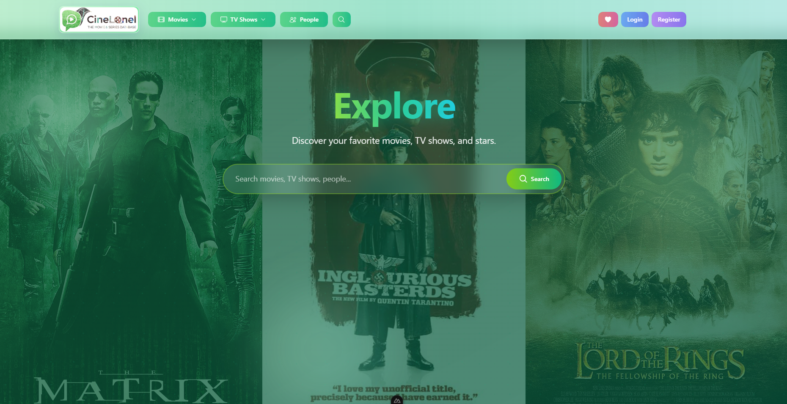
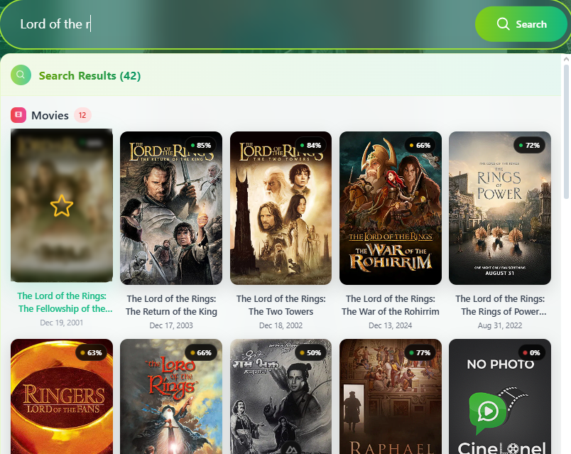
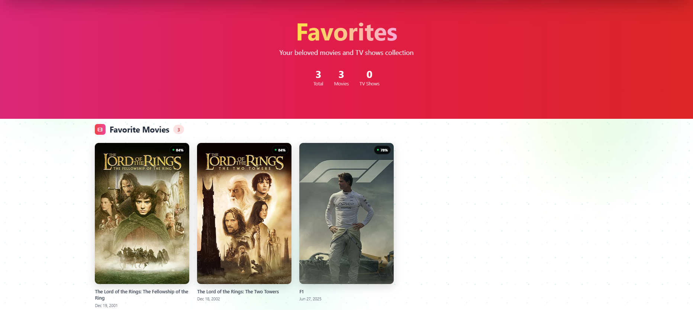
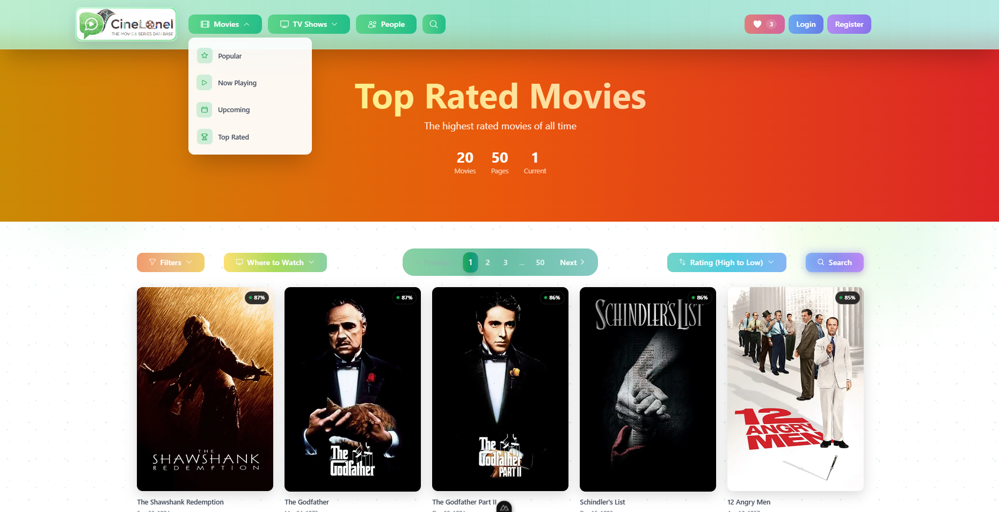
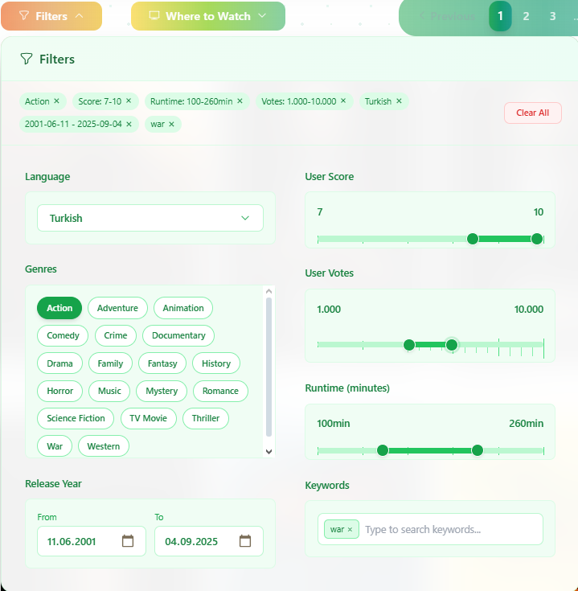
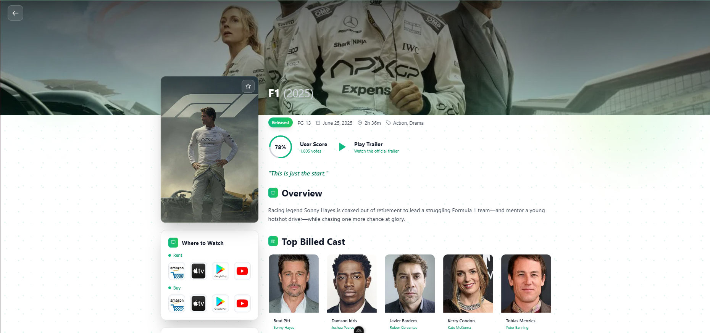

# 🎬 CineLonel - The Movie & Series Database

CineLonel is a modern, responsive web application that serves as a comprehensive movie and TV series database. Built with cutting-edge technologies, it provides users with an intuitive interface to discover, search, and manage their favorite entertainment content. The application integrates with TMDB (The Movie Database) API to deliver real-time, up-to-date information about movies, TV shows, and people in the entertainment industry.

## ✨ Features

- 🎭 **Comprehensive Content Discovery**
  - Browse popular movies, TV shows, and people
  - Real-time search across multiple content types
  - Advanced filtering and sorting options
  - Personalized recommendations

- 🎬 **Movie & TV Show Management**
  - Detailed information pages with rich metadata
  - Cast and crew information with interactive profiles
  - Production company details and financial data
  - Trailer and video content integration
  - Watch provider information (streaming services)

- 🔍 **Advanced Search & Filtering**
  - Multi-category search (movies, TV shows, people)
  - Real-time search results with debouncing
  - Advanced filtering by genre, year, rating, and more
  - Sort options for various criteria

- ❤️ **Personal Favorites System**
  - Add/remove movies and TV shows to favorites
  - Persistent storage using localStorage
  - Categorized favorites management
  - Quick access to saved content

- 🎨 **Modern UI/UX Design**
  - Responsive design for all devices
  - Beautiful gradient themes and animations
  - Glassmorphism effects and smooth transitions
  - Interactive hover states and micro-animations

- 🚀 **Performance Optimized**
  - Server-side rendering (SSR) with Nuxt.js
  - Image optimization and lazy loading
  - Efficient state management with Pinia
  - Optimized bundle size and loading times

## 🛠️ Technologies Used

- **Frontend Framework**: Nuxt.js 4.0.3 (Vue 3)
- **Styling**: Tailwind CSS 6.14.0
- **State Management**: Pinia 3.0.3
- **Language**: TypeScript
- **Build Tool**: Vite 7.1.3
- **Package Manager**: npm
- **Containerization**: Docker & Docker Compose
- **API Integration**: TMDB (The Movie Database)
- **Deployment**: Vercel-ready configuration

## 📱 Screenshots

| Feature | Screenshot |
|---------|------------|
| **Homepage** |  |
| **Search Results** |  |
| **Favorites Page** |  |
| **Top-rated Page** |  |
| **Filters** |  |
| **Movie Details** |  |

**🌐 Live Demo: [https://cinelonel.vercel.app](https://cinelonel.vercel.app)**


## 🚀 Getting Started

### Prerequisites
- Node.js 20.x or higher
- npm 10.x or higher
- Docker (optional, for containerized deployment)

### Installation

#### Method 1: Local Development
```bash
# Clone the repository
git clone https://github.com/yourusername/cinelonel-nuxt.git
cd cinelonel-nuxt

# Install dependencies
npm install

# Set environment variables
# Create .env file with your TMDB API key
echo "TMDB_API_KEY=your_api_key_here" > .env

# Start development server
npm run dev
```

#### Method 2: Docker Deployment
```bash
# Clone the repository
git clone https://github.com/yourusername/cinelonel-nuxt.git
cd cinelonel-nuxt

# Build and run with Docker Compose
docker-compose up --build

# Access the application at http://localhost:3000
```

### Environment Variables
Create a `.env` file in the root directory:
```env
TMDB_API_KEY=your_tmdb_api_key_here
NODE_ENV=development
HOST=0.0.0.0
PORT=3000
```

## 📁 Project Structure

```
cinelonel-nuxt/
├── components/           # Vue components
│   ├── brand/           # Logo and branding
│   ├── cards/           # Content cards (movies, TV shows, people)
│   ├── filters/         # Search and filtering components
│   ├── layout/          # Layout components (header, footer, backgrounds)
│   ├── modals/          # Modal dialogs (trailers, cast details)
│   ├── navigation/      # Navigation components
│   ├── results/         # Search results display
│   ├── sections/        # Page sections (hero, popular, recommendations)
│   └── ui/              # Reusable UI components
├── composables/          # Vue composables (useTmdb, useFilters)
├── pages/                # Application pages
│   ├── movies/          # Movie-related pages
│   ├── tv/              # TV show-related pages
│   ├── people/          # People/actor pages
│   └── favorites.vue    # Favorites management page
├── stores/               # Pinia state management
├── public/               # Static assets
├── Dockerfile            # Docker configuration
├── docker-compose.yml    # Docker Compose configuration
└── nuxt.config.ts        # Nuxt.js configuration
```

## 🔧 Available Scripts

- `npm run dev` - Start development server
- `npm run build` - Build for production
- `npm run generate` - Generate static site
- `npm run preview` - Preview production build
- `npm run postinstall` - Post-installation setup

## 🌐 API Integration

The application integrates with **TMDB (The Movie Database)** API to provide:
- Movie and TV show information
- Cast and crew details
- Production company data
- Watch provider information
- Search functionality
- Image assets (posters, backdrops, profiles)

### API Endpoints Used
- `/movie/*` - Movie-related data
- `/tv/*` - TV show-related data
- `/person/*` - People/actor data
- `/search/*` - Multi-category search
- `/discover/*` - Content discovery

## 🐳 Docker Support

### Development
```bash
# Build and run development container
docker-compose up --build

# Run in background
docker-compose up -d

# View logs
docker-compose logs -f

# Stop services
docker-compose down
```

### Production
```bash
# Build production image
docker build -t cinelonel:production .

# Run production container
docker run -p 3000:3000 -e NODE_ENV=production cinelonel:production
```

## 📊 Performance Features

- **Server-Side Rendering (SSR)** for better SEO and initial load performance
- **Image Optimization** with automatic sizing and lazy loading
- **Code Splitting** for efficient bundle delivery
- **Caching Strategies** for API responses and static assets
- **Responsive Design** optimized for all device sizes

## 🔒 Security Features

- **Environment Variable Management** for sensitive data
- **Input Validation** and sanitization
- **CORS Configuration** for API requests
- **Content Security Policy** headers
- **Rate Limiting** for API endpoints

## 🚀 Deployment

### Vercel (Recommended)
The application is already deployed and live at: **[https://cinelonel.vercel.app](https://cinelonel.vercel.app)**

#### Manual Deployment
```bash
# Install Vercel CLI
npm i -g vercel

# Deploy to Vercel
vercel --prod
```

### Other Platforms
The application is compatible with:
- Netlify
- AWS Amplify
- Google Cloud Platform
- Any Node.js hosting service

## 🤝 Contributing

1. Fork the repository
2. Create a feature branch (`git checkout -b feature/amazing-feature`)
3. Commit your changes (`git commit -m 'Add some amazing feature'`)
4. Push to the branch (`git push origin feature/amazing-feature`)
5. Open a Pull Request

## 📝 License

This project is licensed under the MIT License - see the [LICENSE](LICENSE) file for details.

## 🙏 Acknowledgments

- **TMDB** for providing the comprehensive movie and TV show database API
- **Nuxt.js** team for the amazing framework
- **Vue.js** community for the reactive frontend library
- **Tailwind CSS** for the utility-first CSS framework

## 📞 Support

If you have any questions or need support:
- Create an issue on GitHub
- Live Demo: [https://cinelonel.vercel.app](https://cinelonel.vercel.app)
- Project URL: [https://github.com/yourusername/cinelonel-nuxt]

---

**Made with ❤️ for movie lovers everywhere**
